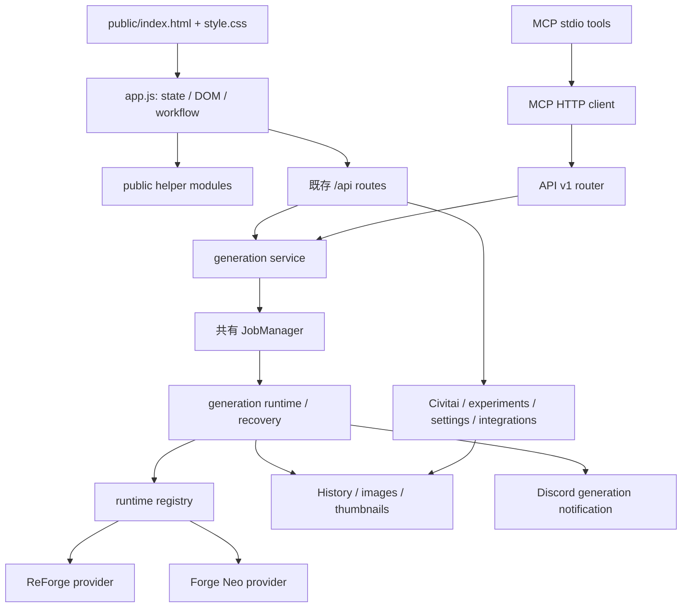

# Local Image Chat — Frontend Refactor Discovery

調査日: 2026-09-06

対象: 既存 `local-image-chat`、HEAD `3527a98` と調査時のworking tree

状態: **Discoveryのみ。実装開始前。推奨はA: Vanilla frontendの段階的module化。**

この文書の追加だけを本タスクの変更とする。新repository、framework、build system、API、runtime、History、設定、storageの変更は行わない。以下のmodule名・interface・Phaseは提案であり、実装済みではない。

調査開始時点で `docs/CURRENT_TASK.md`、`docs/REVIEW_FIXES.md` に既存変更があり、ほかに未追跡の文書・画像・output等が存在した。それらは変更・整理しない。実コードを現在の挙動の根拠とし、README/TODO/過去レビューは意図と回帰条件の確認に使った。実機の稼働状態や過去Smoke Testの成否を、この調査で再確認したとは扱わない。

## 1. Current architecture

### 1.1 調査対象と規模

最低限指定された README、DESIGN、TODO、CURRENT_TASK、REVIEW_FIXES、package.json、index.html、style.css、app.js、ui-kit.js、view-router.js、server.js、services、API v1、generation-runtimes、job-manager、history、forge-neo、testを確認した。既存 `public/*.js` のimport/export、呼出元、関連testを調べ、契約確認のためMCP、storage-settings、reference-assets、migrations、json-store、experiments等も参照した。巨大な履歴文書は見出し・関連箇所を重点的に確認している。

| 現物 | 調査時の規模・役割 |
| --- | --- |
| `public/app.js` | 10,009行。ES moduleだが、画面全体のstate、DOM、通信、workflowを1つのmodule scopeで保持 |
| `public/index.html` | 1,250行。静的な4画面と生成3カラム、入力・canvas・結果・履歴・設定のDOM |
| `public/style.css` | 3,584行。共通部品、旧来のルール、v3 workspace、gallery、Task25の順に定義が積層 |
| `public/` のJS | appを含め22ファイル。うちappが直接importする補助moduleは20、残りはService Worker |
| `src/server.js` | 1,491行。起動、設定・service組立、static配信、legacy API、v1 mount |
| `src/services/` | `generation-service.js` と `prompt-service.js`。HTTP入口間で共有される生成・Prompt処理 |
| `src/job-manager.js` / `src/history.js` | 180行 / 667行。in-memory queue / JSONによる生成・画像記録 |
| `package.json` | ESM、Node >=20、Express 5。frontend build scriptなし。`check` は列挙ファイルのsyntax check、`test` は `node --test` |

根拠の位置は `path:L行番号` と関数名で示す。行番号は調査時点のもの。後続の抽出後は関数名とgit差分も使って追跡する。

### 1.2 実際の実行経路



これは主要経路の図であり、すべてのlegacy操作がJobManagerを通るという意味ではない。`generateLegacyNow()` のReForge経路は従来どおりruntimeを直接実行し、Neo経路は共有queueへ合流する（generation-service:L729–766）。frontendの通常生成は `/api/jobs` を使う。

`index.html:L1248` が `/app.js` を `type="module"` で読み込む。appはブラウザnative ESMを利用しているため、「module化のためにbundlerが必要」という状態ではない。`server.js:L208–239` がpublic、画像、v1を配信する。MCPは画面を経由しない。

### 1.3 初期化と画面寿命

`app.js:L234–354` の `elements` はID配列から `document.getElementById` で組み立てる大きなDOM cache。`L356–554` には補助ID map、Map/Set、state、localStorage復元が並ぶ。

`L556–584` はtop-level awaitによる起動処理。`loadConfig()` → title/checkpoint/img2img/inpaint/Prompt設定復元 → SW・accordion設定 → health/catalog/history/settings等14処理の `Promise.all` → fingerprint・mode・ボタン同期・queue監視、という依存がある。その後の `L585–959` に大量のイベント登録が続く。listener登録はさらに各dialog生成時や `loadConfig()` 等にも存在する。

`showView()`（L1489）は4画面の `.hidden`、body dataset、navのaria、hash/localStorageを更新する。画面DOMの破棄・再作成は行わない。そのため編集内容と生成監視は画面移動を跨いで残る。gallery初回読込やcompare描画へのcallbackもここに入っており、`view-router.js` 自体はhash/画面IDを扱う純粋なhelperにとどまる。

### 1.4 文書と現在コードの差

- `DESIGN.md:L5–12` はVanilla、既存UI部品優先、UI変更を理由にAPI/履歴/状態管理を変更しない方針。今回の推奨と一致する。3カラム、画像配信、Safariを含む検証条件も維持する。
- `TODO.md:L47–51` は「200件取得・ページング未実装」とするが、現在は `loadHistory()` の20画像cursor pagingが存在する。古いTODOをそのまま新規要件にしない。
- `docs/CURRENT_TASK.md` 先頭は別のGPU Lab作業であり、Task20/22/24/25の記録・契約が同居する。このDiscoveryをそれらの実装継続と混同しない。
- `docs/REVIEW_FIXES.md:L31–118` のNeo alias/property順問題は、現在の `forge-neo.js:L266–306` ではcatalog由来modelName・checkpoint先頭POST・GET再検証になり、`task22.test.js:L355–433` に回帰testがある。文書の「修正必要」をそのまま現在のコード不具合とは断定しない。実機復旧状態は未確認。

## 2. app.js responsibility map

「global」はwindow公開globalではなく、appのmodule scopeを意味する。下表の境界は抽出候補の探索用であり、行範囲ごとにそのまま切れば安全という意味ではない。

| 責務 | 現在の代表コード | 実際に行っていること |
| --- | --- | --- |
| Global state / DOM cache | L234–554 | 全画面elements、Map/Set、runtime context、Prompt/LoRA、結果、gallery、timerを保有 |
| Initialization / event handlers | L556–959、L961 `loadConfig`、L9999 | 起動の順序、設定復元、並行load、event登録、PWA登録 |
| Navigation / settings shell | L1489 `showView`、L1515–1627、L1808 | hash、表示、設定カテゴリ・検索・接続summary。生成は停止しない |
| Runtime / checkpoint | L998–1345、L2231–2488 | availability、stale response除外、rollback、selected/active分離、profile自動適用 |
| Checkpoint LoRA sets | L2490–2715 | 保存・複製・削除・autoApply、Prompt/LoRA/settingsへ反映 |
| Generation form / title / busy | L1419–1487、L6718–6817、L9658–9723、L9901–9975 | DOM値読取、mode、seed/count、設定summary、機能別disabled、title/rating |
| Prompt / structured / Raw | L4767–4948、L5060–5315 | 6区分、Raw優先、trigger編集、preview、payload |
| Prompt–LoRA synchronization | L4950–5058、L5081–5190、L9735–9773 | 名前解決・weight・source・disabled、trigger source、生成直前同期 |
| Prompt import / clear / boosts | L5333–5523、L6045–6143、L9067–9160 | AI回答preview、replace/append、clear undo、好みタグと補助入力 |
| LoRA catalog / management | L2717–3140、L3220–3912 | registry/profile合成、folder/category/compatibility、編集、preview、保存値migration |
| Used LoRAs / character / outfit | L7340–7951 | 生成用選択、衣装の独立選択、picker、LoRA master Favorite |
| img2img reference | L1818–1966 | file/Data URL/履歴画像参照、寸法、denoising preset、mode |
| Inpaint editor | L1968–2229 | canvas mask、pointer座標、paint/erase、undo/redo、白pixel検査 |
| IP-Adapter | L3955–4235 | runtime options、upload/履歴参照、object URL、weight/guidance、復元 |
| Generation workflow / Hires | L4237–4526、L5758–5878 | Prompt準備→job→結果、候補選択、Hires、failure/recovery、cancel |
| Queue monitor | L5882–6040 | `/api/queue`監視、terminal差分通知、gallery更新、queue modal |
| Result / studio inspector | L4416、L5702–5756、L6780–7050 | 候補・仕上げ・選択画像・読み取り専用metadata・elapsed timer |
| History retrieval / restore / derivation | L6145–6258、L6612–6714、L8634–9100 | paging、recipe復元、構図固定、delete/detail、同seed/複製/派生 |
| Gallery filter / cards | L7054–7187、L8465–8632 | server filterとclient filter、card、content rating、sort |
| Favorite / Discord status | L6260–6522 | 画像ID単位の全表示同期、通知2系統のwatch/retry |
| Experiments / comparison | L4528–4765、L7996–8459 | baseRequest、実験再監視・CRUD、entry cache、2–4枚選択・投票 |
| Settings / integration actions | L1629–1806、L5528–5689、L6526–6610、L9161–9634 | storage plan/reserve、AI共有、template、Discord、Civitai、更新token |
| Persistence / API helpers / modal | L3157–3218、L8656–8694、L9775–9900、各handler | local/sessionStorage、JSON fetch、画像拡大、prompt/confirm modal。domain処理中にも分散 |

## 3. Frontend dependency map

### 3.1 State、DOM、API、永続化、Historyの対応

R=読む、W=更新する。DOM欄は主要ID/接頭辞を示し、網羅的なID一覧は現行elementsを正本とする。`LS`/`SS` はlocalStorage/sessionStorageで、キーの `localImageChat.` 接頭辞を省略する。APIのprefixは特記以外 `/api`。

| 責務 | R → W state / DOM値 | 主なDOM | API / 他module | 永続化 / History関係 |
| --- | --- | --- | --- | --- |
| 起動・DOM | config/保存値 → 各state、elements | 全体、health、version表示 | config/runtimes/health + 各load、全controller相当 | 保存値を先に復元。History初回loadがlistener登録前に完了し得る |
| navigation | currentView、history cache → currentView | mainNav、viewGenerate/Gallery/Compare/Settings | view-router、loadHistory、compare render | LS view、URL hash。履歴はcache再利用、jobとは独立 |
| form/title/busy | 入力DOM、selectedCheckpoint、runtime、generationBusy → DOM/seed/count/mode | generateButton、width/height/seed、generationTitle、各mode/hires | history-title、preset-catalog、readSettings | LS titleGenerationMode/titleTemplate/candidateCount/contentRating/autoRetry。生成payload経由でHistory |
| runtime/checkpoint | runtimeOptions、token、selected/active、フォーム → runtime、catalog、選択、snapshot | runtimeSelect/Status、checkpointSelect/Status/Profile、mode/hires | runtimes/health/checkpoints/select/refresh、loras、samplers、IP options、checkpoint-profiles | LS runtimeId/lastCheckpoint/checkpointAutoApply/checkpointProfileAssignments。履歴runtimeを先に確定して復元 |
| sampler picker | samplerOptions、DOMの現在値 → DOM sampler/scheduler | samplerPickerButton、schedulerPickerButton、presets | option-picker、ui-kit、GET samplers | LS samplerFavorites/Recent、schedulerFavorites/Recent。履歴復元とprofile適用後にlabel再同期 |
| checkpoint sets | checkpointSets、selectedCheckpoint、selectedLoras、fingerprint、form → settings/LoRA/Prompt | checkpointSet系、generation設定 | checkpoint-lora-sets CRUD、LoRA/profile処理 | server JSON。autoApplyが手編集確認とLoRA再描画へ連動 |
| Prompt | section DOM、raw flags、appliedTriggerWords、LoRA sources → promptMode/raw flags/trigger state/DOM | prompt、negativePrompt、6項目、trigger list、preview | structured-prompt、lora-tags、POST prompt、prompt-import | 構造化/Raw/trigger/noticeをHistoryへ。旧履歴はRaw復元 |
| Prompt補助/import/clear | preferenceData、import解析、current fields → preferenceBoosts、clearedPromptSnapshot、fields | import modal、clear buttons、style/composition等 | prompt-import、ui-kit、history/preferences | LS promptParts。clear undoはmemory、共有templateはserver。副作用のある同期を伴う |
| LoRA selection/sync | installedLoras、Prompt、profile/weight/maps → selectedLoras、sources、disabled、weights、triggers、outfits | loraList、usedLoraList、trigger UI、picker | lora-tags、structured-prompt、lora-profiles、lora-outfit-selection、preset-catalog | LS各LoRA map。履歴weight/source/outfitを復元し実効Promptへ反映 |
| LoRA管理/preview | catalog、registry、checkpoint profile、filter → installedLoras、pinned/displayed、category/folders | loraSearch/List/Preview、folder tree、editor modal | loras/refresh/registry/ensure、PATCH loras/:uid、move、lora-editor/lora-preview | LS loraCategory/loraCompatibilityFilter/profileVersion。master Favoriteはserver、画像Favoriteと別 |
| Civitai | inspectedCivitai、folder/root、token → inspected/catalog/folder memory | civitaiUrl/Token/preview/folder controls | inspect/check-duplicate/install/refresh-registrations、install-folders、lora/install-root/open-root、civitai-folders | LS civitaiRecentFolders/FavoriteFolders、SS civitaiToken、server registry。再load→LoRA→Prompt/CSVへ波及 |
| img2img | file/履歴画像、runtime、generationMode → initImageReference、mode、resolution | initImageInput/preview、img2img設定 | FileReader/Image、generation form、画像配信URL | LS img2imgDenoising/ResizeMode。payload initImageId または initImage。sourceをHistoryに保存するのはserver |
| inpaint | initImageReference、canvas、pointer → maskSourceKey/stacks/tool/drawing | inpaintBaseImage/MaskCanvas、mask controls | img2img helper、Canvas API | LS inpaintDenoising/maskBlur/inpaintFill/inpaintFullRes/Padding。maskのData URLは一時、保存URLはHistory |
| IP-Adapter | runtime options、file/画像、recipe → ipAdapterState/options/objectUrl | ipAdapterInput/DropZone/Enabled、weight/guidance | reforge/ip-adapter/options、image-delivery、Image/URL | ブラウザ内参照は一時。History metadataで復元、Data URL/内部pathを公開v1 DTOへ混入させない |
| job送信/Hires | form/Prompt/LoRA/mode/reference/derivation、選択元runtime → activeJobId/busy/result | jobBar/progress/cancel、candidateGrid、finalResult | POST/GET/DELETE jobs、ui-kit recovery、各payload reader | 一時job ID。結果保存はserver。Hires可否は生成元runtime、pendingDerivationは読取時に消費 |
| queue | queueSnapshot/seenTerminal/polling/panel → 同state | queueIndicator、queue modal | GET queue、DELETE jobs、experiment cancel、queue-view | LSなし。初回過去terminalを通知しない。新規完了でHistory更新 |
| result/studio | lastGeneration/finalGeneration、選択画像、favorite/Discord state → selectedCandidate/finalImage/studioInspection | resultImage、studioMainImage、studioMeta系、studioRecentList | image-delivery、metadata-format、history-title、studio-history | Historyからも同じcanvas/inspectorを更新。描画とform変更の区別が必要 |
| History/gallery | filter/sort/cursor/loading、generations → lastHistoryGenerations/historyEntries/total/cursor | historyGrid、historyLoadMoreButton、gallery filters/tags | history/preferences/recipe/content-rating/delete、gallery-filter | favorites/ratingはserver paging前、その他は取得済み画像をclient filter/sort。Historyが正本 |
| recipe/derivation | recipe/runtime、installedLoras → form/Prompt/LoRA/IP/compositionLock/pendingDerivation | generation form、詳細modal | ensureRuntimeForRecipe、restore群、ui-kit | LSにもweight/trigger等を書戻す。parent ID、derivationは次の生成へ |
| 画像Favorite/Discord | imageFavorites、discordStates/GenerationStates、watcher Sets → mapと全表示 | data-favorite-image、Discord badge、再送 | history/:id/favorite、discord、discord/generation、各send | server Historyのimage単位。renderHistoryが状態を取り込み、2系統の送信状態は独立 |
| experiments/compare | knownExperiments、activeExperimentId、entryCache、compareSelection、共有form → 同state/seed | experimentParameter/Values、compareTray、比較modal | experiments CRUD/cancel/history、comparisons、compare-view | experiments.json等。History削除/実験削除/投票がcache・selectionへ影響 |
| 設定shell/storage | activeSettingsCategory、search、storageState/plan/busy → category/plan/status | settingsSearch/category、storage設定 | storage/settings GET/PATCH、storage/plan POST | serverの予約→再起動移行。frontendが直接ファイルを移動しない |
| Discord設定 | 設定response/入力 → 設定DOM/status | discord設定/test/clear | discord/settings、discord/test | webhookはserver保持、返却しない。通知状態はHistoryと別責務 |
| AI共有/template/update | 手入力trigger、template入力、updateInfo/token → status/template/updateInfo | share toolbar、Grok template、update | ai-share GET/csv/grok、prompt-template GET/PATCH、update/check/apply | server template/CSV、SS githubToken。CSV同期は1,500ms debounceのbest-effort |
| API/modal infrastructure | URL/body/response、focus → response/Error、modal DOM | body追加overlay/toast、imageModal | fetch、ui-kit、既存image modal | transport自身にHistory/LS責務なし。secret保存と同居させない |

### 3.2 既に分離済みの全module

appは以下20moduleを直接importする（app:L1–138）。一覧以外の `sw.js` は `registerServiceWorker()` から登録され、appをimportしない。現行public内のstatic importにはappへの逆importやimport cycleは見つからない。問題の中心はapp内の相互呼出と副作用である。

| module | appでの用途 | module自身の他module依存・注意 |
| --- | --- | --- |
| lora-profiles.js | catalog/profile/preset解決 | 静的 `LORA_PROFILES` とregistry由来profileを解決する。appのassignment/preset/weight mapへ初期値を登録 |
| checkpoint-profiles.js | checkpoint推定、LoRA互換性 | DOM/通信を持たない |
| lora-preview.js | preview URL、推奨weight/filter判定 | 実際のpane/dialog描画はapp |
| lora-outfit-selection.js | 衣装choice/source ID、base trigger | structured-promptをimport |
| lora-tags.js | tag解析・一意解決・weight同期 | backendもimport。DOM非依存を維持 |
| structured-prompt.js | section/trigger正規化・結合 | backendもimport。UI状態を追加しない |
| prompt-import.js | AI回答解析、append、Grok text | structured-promptをimport。反映dialogはapp |
| history-title.js | title正規化/表示 | server/history/generation-serviceもimport |
| preset-catalog.js | LoRA/character/outfit catalog、folder tree、count制限 | resolveProfile等をcallbackで受ける。picker DOMはapp |
| civitai-folders.js | recent/favorite/recommended folder | 純粋関数。LSへの書込はapp |
| view-router.js | 4画面ID/hash | DOM切替・load・queueを持たない |
| option-picker.js | sampler sections/recent/favorite/presets | pickerという名前だがDOM/通信/永続化はapp |
| gallery-filter.js | generation→image entries、filter/sort/tags | server paginationを代替しない |
| studio-history.js | recent filter | 19行の純粋helper。取得と表示はapp |
| metadata-format.js | copy用Prompt/metadata | effectivePrompt等のfallbackを共有 |
| image-delivery.js | thumbnail設定/original URL | DOM imageのerror listener。thumbnail→originalは1回、さらにplaceholder |
| queue-view.js | summaryとqueue panel | handlerを注入。API/poll timerはapp |
| compare-view.js | 比較UIと差分 | ui-kit + image-delivery。投票はonVote callback |
| lora-editor.js | metadata編集dialog | ui-kit。保存/移動等は渡されたcallback |
| ui-kit.js | toast/modal/clipboard/busy | module内toastHost、modalごとのfocus/keydown/close状態、document依存。APIは持たない |

`src/services/prompt-service.js:L1`、`generation-service.js:L20–42`、`src/history.js:L6`、`src/server.js:L29–34` はpublic内の純粋helperに依存する。将来 `shared/` を作るとしても、今回の分割と同時にpathやexportを変えない。frontendをbundler配下へ移す際にも、このimport pathを残す必要がある。

### 3.3 暗黙の依存・循環的な更新

1. **Prompt ↔ LoRA ↔ trigger ↔ Raw preview**。`syncLorasFromPrompt`（L4980）→map保存→`renderLoras`/`renderSelectedLoraSummary`（L3887）→trigger同期→Raw同期。反対向きにLoRA UI操作は `applyLoraWeightToPrompt` 等で入力を書き換える。400ms debounce、programmatic変更flag、`result.changed`、raw overrideが更新を制御する。単純な相互importや汎用event busへ移すと二重挿入・再入・weight上書きが起こり得る。
2. **read/renderと副作用の混在**。`readSelectedLoras()` は同期とLS書込・再描画を起こし、`readDerivationPayload()`（L9725）はpendingDerivationを消費する。`renderHistory()` はstateを更新しDiscord watcherを起動し、条件により `loadStudioRecent()` も呼ぶ。「readerだから何度呼んでも同じ」と仮定できない。
3. **runtime切替は小さなtransaction相当**。token付きcontext、catalog/LoRA/sampler/IPの4取得、snapshot、promise、失敗rollbackが連動する（L1094–1345）。古い応答の反映禁止と `await ensureRuntimeForRecipe()`（L6181）を一緒に維持する。途中だけcontrollerへ移し残りをglobalにするとrollback範囲が崩れる。
4. **selectedとactiveは別**。NeoのUI選択はvalidation、ロードはjob内activation。`applyCheckpointCatalog()` とhealthは実activeを反映する。選択完了をロード完了と表示してはならない。ReForgeの即時切替と同じhandler内にあるため一律化しない。
5. **複数の非同期監視**。自分のjobは850ms、queueは1,200ms・idle 8回、実験監視、Discord2系統、elapsed timer、Prompt/CSV debounceが別々に存在する。view離脱をdispose条件にすると生成継続・通知を壊す。画面寿命とapplication寿命を分ける必要がある。
6. **gallery ↔ studio recent ↔ image状態**。galleryのpaging結果とstudio recentの独自Favorite queryが混在する。`renderHistory()`（L6707付近）はFavorite dataset一致時に結果を再利用するがrating一致までは比較しない。rating絞込時のstudio recentの期待範囲は別途再現・確認対象で、抽出時に黙って修正しない。
7. **gallery応答順**。runtimeにはtokenがある一方、`loadHistory()` はloading中の要求をreturnし、`loadStudioRecent()` に同様のtokenはない。連続filter変更の古い結果/要求取りこぼしはコード上のリスク。今回ブラウザ再現はしていない。挙動変更を伴う対処は抽出と別変更にする。
8. **複数表示間のID同期**。画像FavoriteとDiscordはdataset selectorでdocument全体を更新し、候補・gallery・detail・studioへ反映する。master LoRA Favoriteは別store。カードだけにstateを閉じると同期が失われる。
9. **起動時の評価順依存**。top-level await以前にcache/constants/mapsが必要。`SAMPLER_STORAGE` 等、後方定義もあるため、全listenerの一括前倒しは避ける。import時にloadを始めるmoduleを増やさず、明示initへ徐々に寄せる。
10. **フォーム共有**。compareは別フォームへ全条件を複製せず、生成フォームの設定を `baseRequest` へ読む。Hiresは選択結果のrecipe/runtimeを使う。共通payload化で呼出順・override・seed・title・parent情報を均一化しない。

## 4. Backend contracts that must remain stable

### 4.1 frontendが実際に使うlegacy API

frontend分割を機にv1へ移行しない。現状のJSON helper（app:L9865–9900）はlegacyの `{ error: string }` を扱い、v1のnested errorを前提にしていない。数値inputも `readSettings()` では多くを文字列のまま送っている。抽出時に全数値変換やresponseのunwrapを加えるのは挙動変更となる。

| API群 | 維持する形・意味 |
| --- | --- |
| GET config/runtimes/health | defaults、runtime descriptors、defaultRuntimeId、live health。static情報だけで接続成功を断定しない |
| GET checkpoints/loras/samplers/reforge/ip-adapter/options | runtimeId query、既存catalog/active/feature形を保持。pathにreforgeがあってもruntime registryを経由する |
| POST checkpoints/select / refresh | selectのNeo経路はcatalog validationのみ。refreshは正式再走査後にcatalog取得。ReForgeは既存switch semantics |
| POST prompt | description、LoRA、boost等からPrompt生成。生成backend内でもPrompt処理があり、UI専用処理へ移さない |
| POST jobs / GET jobs/:id / DELETE jobs/:id | `{job}` envelope、0–100 progress、result/error/recovery/meta。取消はDELETE。queue表示用GET queueはgeneration/comparison/summary |
| GET history / preferences / :imageId/recipe | image単位cursor pagingをgenerationへ再group。recipeのimage IDとv1 detailのgeneration IDを混同しない |
| PATCH history/:imageId/favorite / content-rating | Favoriteはserver保存と通知を伴う。ratingはgeneration単位の分類として反映される |
| DELETE history/:imageId | serverの安全なHistory・画像削除。UIでは確認、cache/選択/一覧の既存更新を維持 |
| GET/POST history/:imageId/discord関連 | Favorite用とgeneration用の独立したstatus/send経路。送信本体はserver |
| experiments、checkpoint-lora-sets、comparisons | 現在のCRUD、単一active実験、cancel/delete順、投票、bestImageId、autoApplyを維持 |
| loras registry/ensure、:uid、:uid/move、refresh | 手編集metadataを尊重し、registry identityとruntime内name/folderを保持 |
| civitai inspect/install/check-duplicate/refresh-registrations/install-folders | duplicate選択、指定folder、手動metadata優先、token解決、install後に選択runtimeのLoRA再取得 |
| storage settings/plan、discord settings/test、ai-share、prompt-template、update | 既存設定・予約・clear・best-effort・token寿命を維持。frontendがfilesystem/Discordへ直接アクセスしない |

対応routeの正本: `src/server.js:L241–1086`。API v1との入口共有は `generation-service.js` の `createLegacyJob` / `generateLegacyNow` / `createV1Job`。

### 4.2 API v1 request / response

根拠: `src/api/v1/{router,generations,history,capabilities,assets}.js`、`generation-service.js:L438–766,L891以降`。

- `GET /api/v1/capabilities?runtimeId=...`: checkpoints、samplers、schedulers、loras、defaults、runtime、runtimes、defaultRuntimeId。公開catalog IDを使用する。
- `POST /api/v1/generations`: `mode`（現在のv1はtxt2img）、optional runtimeId/contentRating、`prompt.structured` の6項目、`prompt.rawOverride`（文字列/null）、`prompt.negative`、settings、loras、ipAdapter、metadata.client。Raw指定がstructuredより優先。legacyの `rawPromptOverride: boolean` と混同しない。
- settingsはwidth/height/steps/cfgScale/seed/candidateCount/checkpoint/sampler（samplerName互換）/scheduler/noiseSchedule/hires等。既存validation・省略時のdefaultsとnested hires mappingを保持する。例: candidateCount 1–4、seed -1–4294967295、width/height 256–1536の64刻み。
- createはHTTP 202 `{id,status:"queued"}`。`GET /generations/:id` と `POST /generations/:id/cancel` はpublic job DTO。progressは**0–1**。done時 `result:{historyId,images}`、failed時safe error。legacy full resultをそのまま返す契約ではない。
- `GET /history` は `{generations,limit,total,nextCursor,hasMore}`。`GET /history/:id` のidはgeneration ID。list/detailには差があり、detailのみruntime/derivation/IP等の追加情報を含む。settings.sampler、prompt.rawPromptOverride/rawPrompt/effectivePrompt等の既存field名を保持する。
- `POST /history/:id/regenerations`: sourceImageId必須、runtimeは元履歴から継承（旧履歴はReForge）、reuseSeedと明示seedの排他、candidateCount省略時1、reuseSeed省略時false。LoRA省略=継承、空配列=解除、指定配列=置換。継承PromptのLoRA tag除去規則を保持する。IP参照を含め「全fieldを無条件継承」と仮定しない。
- v1 IP-Adapterは公開referenceImageIdとweight/guidanceを解決する。UI用Data URLの形と統合しない。
- `POST /assets/images` はPNG/JPEG/WebPのraw bytes、12MiB上限、HTTP 201 asset DTO。JSON/multipart/pathは受け付けない。importした公開IDをIP参照へ渡す。
- errorはHTTP statusと `{error:{code,message}}`。malformed JSON、not found、runtime/capabilityエラーの既存mapping、path/secretを伏せるDTOを維持する。

### 4.3 Runtime / checkpoint / Neo activation

`generation-runtimes.js:L12–92` のruntime IDは `reforge` と **`forge-neo-anima`**。NeoがXL profileも扱うことを理由にIDを改名しない。provider descriptor ID、configの `runtimes.forgeNeoAnima`、profile ID、公開checkpoint ID、表示labelは異なる概念。

runtimeId省略時はregistryのconfigured defaultへ解決する。旧Historyのruntime欠落は復元・再生成側でReForgeと扱う。この2つのfallbackを混同しない。frontendの `runtimePayloadFor()` / `runtimePayload()` の省略条件も抽出時そのままにし、default/explicit選択は回帰fixtureで固定する。

Neoのcatalogは設定profile allowlist、公開相対ID、設定順序を維持する。hash/title/modelName/absolute filenameを同一視しない。`forge-neo.js` のpublic IDと、options POST用catalog `model_name` は意図的に別。

現在の `prepareGeneration()` は以下を行う。

1. `GET options → GET sd-models → GET sd-modules` で実状態・catalogを読む。
2. requested checkpointに対応するallowlist profileと必要modulesを検証する。曖昧/不足時は生成へ進まない。
3. preloadedは一致検証だけ。managed-optionsも完全一致ならPOSTなし。
4. 変更が必要なmanaged-optionsは **sd_model_checkpoint → forge_preset → forge_additional_modules** のproperty順で1回POSTする。checkpointは安全なcatalog modelNameを使う。
5. GET optionsで再検証し、成功してからtxt2img。activation失敗時はtxt2img/History追加へ進まない。

activationは共有JobManagerの実行時に行う。選択UI、health、catalog取得からloadを発火しない。`cmd-flags` をreadinessへ流用しない。Neoは現在txt2img中心でimg2img/inpaint/Hires/IP-Adapter非対応、ReForgeの対応機能をUIから消さない。対応判定はlabel文字列ではなくdescriptor/featuresから行う。

### 4.4 JobManager / recovery / experiments

`src/job-manager.js` はin-memoryの1本のFIFO queue。queued→running→done/failed/cancelled、progress単調増加、実行中は最大99、doneで100。create時に処理を起動し、terminal jobは既定1時間保持（cleanupはcreate時）。再起動後もjobが永続化されるとは約束していない。

queued取消はqueueから除去してcancelled、running取消はAbortControllerを通して実行側へ通知する。すでにterminalなら取消は状態を維持する。terminalでpayloadを解放し、public DTOへpayload/controllerを出さない。subscribeは状態遷移を通知し、listener例外でqueueを停止しない。

recoveryはgeneration runtime/serverの既存方針と、UIの提案承認・1回再送（app:L5758–5851）に跨る。全POSTを自動retryするHTTP clientを導入しない。通常job、実験run、queue表示のstatus名（comparison側にはcompletedもある）を独自に統一しない。

experimentsは永続run状態とjob subscribeを持つ。サーバー再起動・job消失時の未完了run正規化、active実験の競合拒否、削除前cancel、recoveryで条件が下がった表示は保持する。backend組立で `generationDependencies.experiments` を後から接続している点もfrontend分割の対象外。

### 4.5 History / storage / Discord / MCP

History JSONは `{schemaVersion: 2, generations: [...]}`。LoRA registryのmigration versionは6（`migrations.js:L11–12`）。Historyの正本は `src/history.js` の `normalizeGeneration`（L506）と読取normalizer、`migrations.js`。generationにはid/createdAt/title/description/kind/mode/contentRating、Prompt各形、settings、LoRAとsource/notice、source/mask/IP、runtime `{id,provider}`、parent/derivation、experiment/retry、imagesを保存する。imageにはid/imageUrl/filename/seed/size/favorite/vote/contentSha256、`discord` と `discordGeneration`。新規rating defaultはgeneral、旧履歴欠落はunrated。旧structured欠落はRaw復元、旧LoRA source欠落はui。欠落値をfrontendの都合で一括migrationしない。

`listPage()` は**画像数**でページを切り、同generationの画像を再groupする。nextCursorは最後の画像ID。filter後にpageを作り、存在しないcursorはerrorになる。append時に同generationをmergeする `mergeHistoryGenerations()` を維持する。画像ID/generation ID/recipe IDの取り違えを防ぐ。

storageはconfig.json/config.local.json/env、data内JSON、設定済みoutput root、favorite/thumbnails、reference-assetsを使用する。`server.js:L115–207` はinstance lock後・listen前のstorage予約移行とデータmigrationを行う。`storage-settings.json`、History、LoRA registry、experiments、checkpoint sets、reference-assets registry等の形式・marker・backup・JsonStoreの書込順は変えない。frontendのLSにも既存キー・文字列/JSON/Map変換・PROFILE_STORAGE_VERSION=3の規則があり、中央store導入を理由に初期化し直さない。

画像は `/api/images/:id/thumbnail|original` と既存 `/outputs`・`/favorites` 配信を維持する。一覧はthumbnail、選択時のみoriginal、失敗時の1回fallback、cache-bustingなし。reference-assetsのhidden directoryをstatic全公開しない。

DiscordはFavorite通知と生成完了通知を別状態で扱う。not_sent/sending/sent/failed、送信済み重複防止、再送、Favorite解除時に投稿を消さない挙動、webhook非返却を保持する。通知送信はbackendの責務で、frontend抽出で外部送信を追加しない。

MCPは `src/mcp/tools.js` の9 tools（get_capabilities、generate_image、get_generation、cancel_generation、get_history、get_history_item、regenerate_image、get_image、import_reference_image）、schemas、HTTP clientを保持する。MCPはv1経由のthin wrapper。get_imageは公開IDからthumbnailを取得してMCP image contentへ変換し、attachment importは許可された添付境界を通す。tool名、入力、省略/null semantics、safe DTO、error mapping、画像bytes→base64変換境界をfrontend都合で変更しない。

## 5. Technical debt

| 観察した負債 | 開発への影響 | 今回の扱い |
| --- | --- | --- |
| 10k行のcompositionとfeature実装の同居 | 変更の影響が画面・runtime・永続化を横断 | 責務ごとに段階抽出 |
| module state + DOMが混在して正本を持つ | form値とJS値、label/disabledの同期漏れ | 最初から全面store化せず、ownerとread/write portを定義 |
| reader/renderの副作用 | 「共通化」で呼出回数が変わるだけでもregression | characterization後に移動。純粋化は別差分 |
| timer・listener寿命が明示されない | 再initで二重監視、view離脱で誤停止 | app lifetimeを維持し、各抽出でinit/dispose方針を明記 |
| errors/HTTP直接fetchが分散 | helper化で既存の失敗表示を変えやすい | helper4関数だけから開始し、direct fetchは別途 |
| runtime snapshotに他責務stateを含む | 部分抽出でrollback/復元が不完全になる | coordinatorに限定したsnapshot/restore port |
| publicにbackend共有helper | frontend移動がserver importへ波及 | path/export固定。UI副作用を入れない |
| galleryとstudioのcache/update結合 | filter/paging/通知の範囲が不明瞭 | 現状をtestで固定、仕様変更は分離 |
| 古いCSS上書きとsource順への依存 | 機械的CSS分割でも見た目が変化 | JS分割PhaseでCSSを整理しない |
| HTML依存の大きなDOM map | ID欠落1件で初期化停止、testがpathに依存 | 責務単位のDOM渡しへ移行、ID照合testを維持 |
| source文字列testが多い | 関数移動で失敗/見逃し、実行順の保証が弱い | 移動対象だけbehavior testへ補完し、assertを削除しない |
| ドキュメントに旧仕様が残る | stale TODOを根拠に重複実装する危険 | 本書で差を記録。旧文書の一括修正は行わない |

これらは全てを直してから分割する前提ではない。推定リスクと再現済み不具合を区別し、抽出の必要条件に限って対処する。

## 6. Proposed target architecture

### 6.1 native ESMのままcomposition rootを小さくする

候補配置は次のとおり。最初に全ファイルを作らず、Phaseごとに必要なものだけ追加する。既存helperは当面現在位置を維持する。

```text
public/app.js                      # composition root、初期化順、feature間workflow接続
public/core/http-client.js         # 既存JSON helperの挙動
public/core/preferences.js         # 既存storage access（後続Phase）
public/features/navigation.js      # 4画面表示、hash、nav
public/features/sampler-picker.js
public/features/settings-*.js      # storage / Discord / AI共有等を責務別に追加
public/features/runtime-controller.js
public/features/checkpoint-sets.js
public/features/prompt-controller.js
public/features/lora-selection.js
public/features/lora-library.js
public/features/civitai-controller.js
public/features/reference-image.js
public/features/inpaint-editor.js
public/features/ip-adapter-controller.js
public/features/generation-controller.js
public/features/queue-controller.js
public/features/history-controller.js
public/features/recipe-workflow.js
public/features/image-state.js     # 画像Favoriteと通知status（master LoRAと分離）
public/features/studio-controller.js
public/features/experiment-controller.js
public/features/comparison-controller.js
public/*.js                       # 既存pure helpers / UI部品のpathとexportを維持
```

dependencyは `app → feature controller → UI/pure helper / HTTP / preferences` を基本とする。featureからappをimportしない。相互workflowはappがcallbackで接続し、汎用event bus・巨大なcontext/state全渡しは導入しない。

例えばqueueは `onCompleted`、`openGenerationResult`、`openExperimentResult` を受け、Historyやnavigationを直接importしない。Historyの「読込」は `onLoadRecipe(recipe,image)` に委譲し、recipe workflowがruntime完了→form/Prompt/LoRA復元の順序を所有する。runtimeは小さなform/selection snapshot portを受け、galleryやDiscord状態は持たない。

### 6.2 state ownershipと寿命

| owner候補 | 持つstate | 外へ渡すもの |
| --- | --- | --- |
| navigation | currentView | getCurrentView/showView、画面表示callback |
| runtime | options、selected runtime、catalog、selected/active checkpoint、token/snapshot/promise | context、feature判定、切替完了Promise、必要なsnapshot port |
| Prompt + LoRA coordination | raw/structured/trigger、selection/source/disabled | read/restore/updateの狭いAPI。循環が整理できるまでは1つのcoordinator配下 |
| generation | activeJobId、busy、送信/回復 | progress/result callbacks。queueは全jobの観測を担当 |
| history | generations/cursor/filter/load state | page snapshot、refresh、image/recipe操作callback |
| image state | Favorite/status map、watcher Sets | image ID単位の通知/表示更新。Historyが永続正本 |
| studio/result | 選択画像/候補/inspection、表示timer | 選択と明示action。form自動書換を増やさない |
| reference/inpaint/IP | source、canvas history、object URL | 既存payload形、reset/restore |

DOM値を全て新storeへ複製しない。最初の抽出では「現在DOMが保持する値はDOMが保持する」形で安定させる。全controllerはimport時のfetch/listener登録を避け、appがinitする。app lifetimeのmonitorは画面切替でdisposeしない。disposeはpage全体の終了やtest teardown向けであり、既存cancel APIの呼出と結び付けない。

## 7. Refactor phases

全PhaseでUI redesign、API変更、新framework、storage migrationを混ぜない。各Phaseは1つのPR/レビュー単位を目安とし、下記は推奨順。後半を1つの巨大Phaseへまとめない。対象範囲は第2節の関数を正本とする。

| Phase | 対象コード → 新module候補 | 依存/境界 | regression risk | 必要test・完了条件 |
| --- | --- | --- | --- | --- |
| 1: JSON transport | L9865–9900の4関数 → core/http-client.js | fetchだけ。URL/body/error形不変。direct fetchは残す | 低 | fetch stubでmethod/header/body、成功JSON、legacy error/HTTP fallback、JSON parse失敗とnetwork rejection、再送なし。既存UI test/check通過 |
| 2: Navigation | L1489–1513、L1808–1816、nav/hash listener → features/navigation.js | view-router、DOM subset、gallery/compare callbacks | 低〜中 | hash優先とLS fallback、4画面、back/hashchange、view変更でform保持・cancelなし。ui-shell + listener二重登録なし |
| 3: Sampler picker | L7191–7336、picker/preset listener → features/sampler-picker.js | option-picker、ui-kit、runtime context、form同期callback | 低〜中 | current/favorite/recent/search、stale catalog、profile/recipe後のlabel一致。保存キー不変 |
| 4: Settings shell | L147–232、L1515–1627とsearch/category listener → features/settings-navigation.js | DOM subset、runtime connection summaryの入力 | 低 | カテゴリ・検索先・focus・狭幅。settings値/保存処理は移さない |
| 5: Discord settings | L6526–6610と設定listener → features/settings-discord.js | HTTP、ui-kit | 中 | safe settings表示、secret非返却、clear/cancel、testボタン。mock APIのみ、実送信なし |
| 6: Storage settings | L1629–1806と関連listener → features/settings-storage.js | HTTP、ui-kit、plan/state | 中 | plan→reserve、invalid plan、取消、busy、再起動案内、旧保存先維持。storage-settings/server testを対象に含む |
| 7: AI共有/template | L5528–5689 → features/ai-share.js | manual trigger getter、HTTP、ui-kit、debounce | 中 | 1,500ms debounce、best-effort失敗、clipboard失敗、手入力優先payload、template保存/restore。ai-share/prompt-import test |
| 8: Queue monitor | L5882–6040 → features/queue-controller.js | queue-view、HTTP、timer、通知/result callbacks | 中 | fake clockで初回terminal抑制、新terminal通知1回、取得失敗でsnapshot維持、idle停止/panel維持、view移動時継続。queue-view/job-manager |
| 9: 画像Favorite/通知state | L6260–6522 → features/image-state.js | History API、image ID、dataset、ui-kit、timer | 中〜高 | 候補/gallery/detail/studio全同期、通知2系統独立、watch重複なし、failed再送、解除で投稿削除なし。favorite-sync/discord/UI test |
| 10: Studio結果表示 | L5702–5756、L6780–7050、L3157–3218 → features/studio-controller.js + image-modal.js | image state、image-delivery、metadata/title、action callbacks | 中 | 一覧でoriginal先読なし、選択/拡大、metadata copy、runtime別Hires表示、canvas/フォーム操作の分離。画像系/studio-history/compare test + browser |
| 11: Gallery取得・描画 | L6612–6714、L7054–7187、L8465–8632 → features/history-controller.js | HTTP、gallery-filter、card action ports、studio/image state | 高 | 画像単位cursor、同generation merge、Favorite/ratingと他filter、append/失敗/空、return時cache。History/image-delivery/server tests。第3.3節のraceは別fix |
| 12: Compare selection | L8288–8459 → features/comparison-controller.js | compare-view、selection Map、vote API、History snapshot | 中 | 2–4枚、tray/gallery双方向、投票/best、削除後選択整合、original明示取得。compare-view/UI tests |
| 13: Experiment workflow | L4528–4765、L7996–8286 → features/experiment-controller.js | form snapshot callback、HTTP、queue/History callbacks | 高 | baseRequest/seed固定、reload監視、同時1本、cancel/delete順、recovery badge、entry cache。experiments/server-experiments/job-manager |
| 14: Runtime/checkpoint | L998–1345、L2231–2488、health連携 → features/runtime-controller.js | form/LoRA snapshot port、catalog loader、HTTP | 高 | delayed応答の順序逆転、4取得の部分失敗rollback、health active無し、selected≠active、refresh event wrapper、旧runtime復元。task20/task22/API v1 |
| 15: Checkpoint sets | L2490–2715 → features/checkpoint-sets.js | runtime、form/LoRA ports、fingerprint | 高 | 未保存手編集確認、autoApply、複製/削除、runtime別選択とPrompt/LoRA維持。checkpoint-sets/profiles/server-workspace |
| 16a: LoRA管理 | L2717–3912の管理処理、L7507 picker → features/lora-library.js | catalog/profile helper、selection port、ui-kit、HTTP | 高 | tree/曖昧同名/registry手動優先/metadata編集、profile migration。LoRA/preset/UI test |
| 16b: Civitai導入 | L9161–9580 → features/civitai-controller.js | library再load、folder helper、HTTP/SS/CSV callback。16a完了後 | 高 | duplicate/move/folder/手動値維持/選択runtime再load。Civitai/task22/server-workspace test |
| 17: Prompt・選択coordinator | L4767–5523、L7340–7497/L7847–7951の選択、L9735–9773 → prompt-controller + lora-selection | pure helper、DOM、preferences、library read port。まず両者の更新順を1 coordinatorに保持 | 最高 | duplicate/ambiguous/uninstalled/source、Raw編集優先、trigger独立weight/削除/outfit、import append/replace、clear undo、生成直前同期。構造化/LoRA/outfit/import/API/History tests |
| 18: Reference image | L1818–1966 → features/reference-image.js | FileReader/Image、form mode/resolution callback | 中 | file size/MIME、履歴参照とupload、解像度丸め、clear、mode、保存値。browser file flow + backend img2img fixture |
| 19: Inpaint | L1968–2229 → features/inpaint-editor.js | reference port、canvas、pointer、preferences | 高 | scale変換、paint/erase、白pixel判定、12履歴undo/redo、画像交換/reset、出力PNG mask。実canvasを含むbrowser検証 |
| 20: IP-Adapter | L3955–4235、payload reader → features/ip-adapter-controller.js | runtime、reference/image URL、form | 高 | option stale、enable/reference必須、guidance範囲、object URL revoke、旧recipe、Neo無効/ReForge有効。reference-assets/API/MCP + browser |
| 21: Recipe workflow | L6145–6258、L8696–8979の復元/派生 → features/recipe-workflow.js | runtime待機→Prompt/form/LoRA/IP portsの順序を所有 | 最高 | 旧履歴Raw、欠落runtime=ReForge、復元失敗時の変更範囲、同seed/複製、parent/derivation1回消費、outfit/source保持。History/task20 + controller test |
| 22: Generation orchestration | L4237–4526、L5758–5878、L9658–9733、busy連携 → features/generation-controller.js | 準備済みのform/prompt/reference/runtime/result ports | 最高 | endpoint/payload完全一致、呼出順、二重投入、cancel/recovery1回、Hires元runtime、生成中navigation。job/runtime/API/History/Discord mock統合 |
| 23a: Preferences access | L9775–9863と残存storage access → core/preferences.js | 既存key/変換/呼出順を固定 | 中 | 保存済みLS/SS、破損JSON fallback、profile version。domain移動と同時に形式を変更しない |
| 23b: Version/update | L1347–1417、L9580–9634の関連処理 → features/settings-update.js | HTTP、preferences、version表示DOM | 中 | version不一致、update check/apply失敗、SS token寿命。updater/UI-shell test、実更新なし |
| 23c: Bootstrap | L556–959の残存composition、loadConfig、SW登録 → app.jsの明示bootstrap | 各controller init、config、PWA。他の抽出後に実施 | 高 | config fallback、初回loadとlistener順、再init防止、page再読込のqueue復元、PWA/UI/server test |

16a/16b、23a/23b/23cはそれぞれ独立したPhase・PRとして実施する。安全性のためPhase数は多く、全Phaseを連続実施する承認をこの文書から推定しない。各Phase後に残った結合を再評価する。

### 7.1 各Phase共通のgate

1. 対象functionのcaller、read/write、timer/listener、server/public helper参照を再確認する。
2. 移動前の挙動をfixtures/stubsで固定する。高riskはpayloadだけでなく**順序**・失敗後state・非同期競合を検証する。
3. 関数移動、import、狭い依存注入、関連test移設に限定する。命名整理・bug fix・UI修正を混ぜない。
4. `npm.cmd run check` の明示ファイル列挙へ新moduleを必要に応じ追加し、対象testsを実行する。既存source断片testは新path/behaviorへ移し、単にassertを消さない。
5. browser DOM/Canvasを扱うPhaseはDESIGNの1366×768（100%/125%）、1920、2560、390–430px/iPhone Safari条件の関連部分を確認する。source CSS testだけで実レイアウト保証としない。
6. API/request/response・History fixture・保存keyに差がないこと、正常/失敗/キャンセル後のstate、view移動継続をレビューする。高risk境界では全 `npm.cmd test` をrelease前gateにする。
7. rollbackは当該コード差分のrevertで可能に保つ。data/config/outputを戻す必要のある変更は抽出Phaseへ含めない。未達ならそのPhaseで停止し、次責務へ広げない。

## 8. Risk analysis

### 8.1 既存testで分かることと分からないこと

`test/ui.test.js` はapp内のelements宣言と使用・HTMLのIDをsource解析で照合する。`ui-shell`、`image-delivery-ui`、`layout-overflow`、task20/task22のUI部分もsource文字列のassertを含む。これらはID欠落や保護ルールの消失を防ぐが、browser実行時の順序、focus、canvas、network race、レイアウトを完全には保証しない。

一方、structured-prompt/lora-tags/preset-catalog/metadata/queue/compare等はhelper単体testがあり、backendにはhistory/job-manager、server integration、runtime/provider、API v1、MCP、reference-assets、Discord/Civitai/storage等のtest資産がある。React等へ移る場合もこの資産は再利用できるが、appのDOM動作testを自動で代替してくれるわけではない。

不足する主なtest seamは、runtimeの遅延Promise、Prompt/LoRA再入、History連続filter、viewを跨ぐtimer、canvas編集、移動後moduleのDOM binding。最初のPhaseのためにE2E基盤を全面導入せず、該当Phaseで小さなstub/fixture・browser検証を補う。

### 8.2 今回実施した検証

- Node `v24.16.0`。
- `npm.cmd run check`: exit 0。
- 以下14ファイルを `node --test` に渡した選択suite: **144 passed / 0 failed / 0 skipped**。

```powershell
node --test test/ui.test.js test/ui-shell.test.js test/layout-overflow.test.js test/image-delivery-ui.test.js test/image-delivery.test.js test/structured-prompt.test.js test/lora-tags.test.js test/lora-outfit-selection.test.js test/prompt-import.test.js test/preset-catalog.test.js test/queue-view.test.js test/compare-view.test.js test/studio-history.test.js test/metadata-format.test.js
```

backend/MCP等のtest sourceは契約確認に読んだが、今回全suiteを実行したとはしていない。実ブラウザ操作、実生成、Neo/ReForge起動・切替、Discord送信、Civitai download、storage移行は実施していない。したがって、この144件は現行frontendの限定baselineであり、実機の全機能正常や全refactorの安全性の証明ではない。

### 8.3 主要riskと停止条件

| risk | 重要度 | 回避/停止条件 |
| --- | --- | --- |
| helper移動でbackend import破損 | 高 | public共有3moduleのpath/export固定。backend importに影響したらscope再分離 |
| runtime selectedをactive扱い/activationをUIへ移設 | 最高 | task20/22契約維持。options発火位置/順序に差があればmergeしない |
| job/pollの再送・停止による生成/通知重複 | 高 | monitor寿命・cancel/recovery契約を固定。新HTTP自動retry禁止 |
| LoRA/Raw/triggerの実効Prompt変化 | 最高 | request + History roundtrip fixtureを比較。1語/weight/sourceの差も理由なしには許容しない |
| 履歴のruntime/画像ID/parent消失 | 最高 | old/new recipeとderivation fixture。DTO簡略化を抽出に混ぜない |
| 保存key/format変更で既存設定喪失 | 高 | storage diffなし。既存LS snapshot復元をtest |
| CSS移動でcascade/Safari崩れ | 中〜高 | 当初CSS/index構造不変。見た目変更は別タスク |
| 文書の過去記録を現況と誤認 | 中 | 現コード/test/実機未確認を区別し、明示的な調査範囲を維持 |

## 9. Rewrite vs incremental refactor comparison

相対評価。工数の時間/人日はコード調査だけでは確定できないため、根拠のない日程は示さない。

| 評価軸 | A. Vanilla段階module化 | B. frontendをReact/Vite等へ置換 | C. repository全rewrite |
| --- | --- | --- | --- |
| 実装コスト | 低から始められる。全体完了は中規模以上だがPhase単位で価値が出る | 高。UI再実装に加えbuild/deploy/testとDOM-state移行 | 最高。provider・queue・History・API・MCP・統合も再構築 |
| regression risk | 小範囲の挙動比較が可能。難所はPrompt/runtime/recipe | 高。controlled form、effect寿命、dialog、canvas、hidden view保持の変化 | 最高。既存失敗経路・互換性・永続化の抜けを広範囲に作る |
| 既存資産再利用 | HTML/CSS/20helpers/backend/testsをほぼ維持 | backend/pure helperは再利用、DOM rendererと一部UI testは書換 | 部分的。契約/test/fixturesは必要だが実装再利用を減らす |
| maintenance | owner/portsを守れば改善。frameworkなしでも十分整理可能 | component/開発toolの利点。ただし依存・build・effect管理の保守が増える | 初期設計自由度は高いが現在の知識を再獲得する負担が大きい |
| migration difficulty | 既存entryを保ち1責務ずつ移動。data migration不要 | widget単位共存は可能だがDOM二重所有・CSS競合・ESM共有path・routingに配慮が必要 | API/MCP/storage互換layer、旧新並行運用、rollback/data migrationが難しい |
| 現要求との適合 | **高い**。安全なfrontend開発構造に直接対応 | 現時点では過大。UI機能要件やチーム事情から必要性が出た時に再評価 | 低い。保護したい既存資産を最大範囲で変更する |

**Aを推奨する。** 既にnative ESMと純粋helper/UI部品があり、不足しているのはframeworkではなくstate ownershipとworkflow境界である。最も複雑なruntime/Prompt/History契約はB/Cでも理解とtestが必要で、置換によって消えない。Aで境界が明確になった後、特定画面にcomponent frameworkが必要になれば独立したB評価を行える。現在Cを正当化する、backendやstorageを捨てる必要性は見つからない。

## 10. Recommended next task

**Phase 1「legacy JSON transport helperの抽出」だけを次タスクとする。**

対象はapp:L9865–9900の `getJson` / `postJson` / `patchJson` / `deleteJson`。`public/core/http-client.js` を追加しappからimportする。関数の挙動を維持し、`fetchImpl` を使うtest seamを設ける場合もdefaultは現在のfetchと同じにする。API paths、body serialization、response.jsonの順序、error文言、reject伝播を変更しない。

最初のタスクで `/api/config` 等のdirect fetch統合、v1 client化、retry/timeout/AbortController追加、保存key整理、DOM/state移設は行わない。小さい抽出でnative ESMの配信、check対象、新module test、既存importの運用を確認でき、後続featureの依存を1つ減らせる。

受入条件:

1. 既存4関数のcallerと外部から見える成功/失敗挙動が同じ。
2. transport testでmethod/header/body/JSON/rejectを確認し、生成POSTが自動再送されない。
3. 新moduleを含むsyntax checkと今回の144件baselineが通る。
4. backend、API v1、MCP、runtime、History、config/data/output、index/CSS、既存public共有helperに変更がない。
5. appからhelperへの一方向importで、import時に通信やDOM副作用がない。
6. この小さな差分をレビューした時点で停止し、次Phaseは別タスクで選ぶ。

本Discoveryでは上記実装を開始していない。次の作業の範囲と検証可能な条件を定めたところで停止する。
