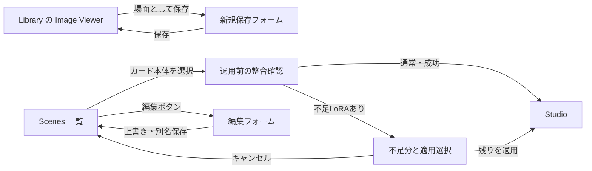

# Scenes — 画面構成と接続設計

2026-09-11実装追補: 本書作成後の明示GOにより初回範囲を実装した。以下の「実装未開始」「GOまでは進めない」は設計作成時点の記録。採用内容、実装時調整、検証結果と残存gateは[Scenes実装記録](../implementation/scenes-initial.md)を参照する。

2026-09-11。ユーザーから一覧・保存・編集画面と既存機能への接続設計のGOを受けて作成。[確認済み要件](scenes-requirements.md) S01–S23を入力とする。**設計案であり、Production実装は未開始**。以下の配置・API・例外操作は今回の設計判断であり、ユーザーが個別に回答した要件とは区別する。

## 1. 全体構成

ナビは `Studio / Library / Scenes`。Scenesは画像付きの場面一覧、保存・編集は同じフォームのdialogとして実装する設計。既存Studioの生成draftを再作成せず、Scenesでの編集は保存用の一時フォームに限定する。



保存成功時は元のLibrary Viewerを保持して「保存しました」を表示する。「Scenesを開く」は任意の次操作とし、保存だけでStudioの構成は変更しない。Scenesからの適用成功でも生成は開始しない。

## 2. 一覧画面

```text
 Studio   Library   [Scenes]                         接続・生成状態
 ──────────────────────────────────────────────────────────────
 Scenes            [名前で検索…………]   [一般] [NSFW]   [更新]
 12件 · 更新が新しい順

 ┌─────────────────┐ ┌─────────────────┐ ┌─────────────────┐
 │                 │ │                 │ │                 │
 │    代表画像      │ │    代表画像      │ │    代表画像      │
 │                 │ │                 │ │                 │
 ├─────────────────┤ ├─────────────────┤ ├─────────────────┤
 │ 夜の街・立ち姿    │ │ 室内・座り姿     │ │ 公園・振り返り   │
 │ 元: One obsession│ │ 元: Silvermoon  │ │ 元: 不明        │
 │            [編集]│ │            [編集]│ │            [編集]│
 └─────────────────┘ └─────────────────┘ └─────────────────┘
                       [さらに読み込む]
```

- カードの画像・名前部分は一つの適用button。「編集」は兄弟buttonとし、入れ子buttonや編集時の誤適用を避ける。hoverしない端末でも編集入口を表示する。
- 名前は最大2行。保存元Checkpointは1行省略とし、フォーカスまたはタップで全文を確認できる。`title`だけに依存しない。保存元が不明なら「元: 不明」。現在のCheckpointと一致する保証には使わない。
- 画像は縦横比を保ったcontain表示。名前とCheckpointを読み取れるカード幅を確保する。PCは幅に応じ3〜5列、390〜430pxは2列を基準とし、拡大文字で無理なら1列へ折り返す。
- 初回一般、更新日時降順。同時刻はIDで順序を固定。名前検索は全保存件数を対象とし、ページ取得済みの範囲だけでは検索しない。
- Studio往復では検索・分類・読み込み済み一覧とscroll anchorを保持。別端末の更新を取得しても、同一queryでは表示中のカードを基準に位置を保つ。query変更時は先頭へ戻す。
- Scenes表示中はStudioのCanvas toolbar・Prompt Dock・Recentを隠し、一覧に領域を使う。App Barの既存生成状態は継続表示する。navigationで生成・monitorを停止しない。
- 0件は「まだ場面がありません。Libraryで画像を開き、場面として保存できます」＋Libraryへの入口。検索0件は「条件に合う場面がありません」。通信失敗時は既存表示と再試行を残す。
- 色・余白・角丸は現在のStudio tokenを利用。Glassは操作面のみ。新たな色体系や別frameworkは導入しない。

## 3. 保存画面

LibraryのImage Viewerへ「場面として保存」を追加。選択画像IDを固定して保存候補を取得する。取得待ち中にViewerで別画像へ移っても、別画像の内容を混ぜない。

```text
 場面として保存                                             [閉じる]
 ┌────────────────┬─────────────────────────────────────────────┐
 │ 代表画像        │ 名前 [夜の街・立ち姿……………………………………]       │
 │                │ 分類 [一般] [NSFW]                           │
 │ [画像を変更]    │                                             │
 │                │ 保存するPrompt                              │
 │ 保存元         │ [✓] 容姿・衣装       [編集用textarea]         │
 │ Checkpoint名   │ [✓] ポーズ・構図     [編集用textarea]         │
 │                │ [✓] シチュエーション・背景 [textarea]         │
 │                │ [✓] 画風・品質       [編集用textarea]         │
 │                │ [✓] 追加プロンプト   [編集用textarea]         │
 │                │                                             │
 │                │ [✓] LoRAを含める                            │
 │                │ [✓] Style A                  weight [0.60]   │
 │                │ [ ] Character B              キャラクター    │
 │                │                                             │
 │                │ [ ] Negativeを含める  [textarea]            │
 └────────────────┴─────────────────────────────────────────────┘
 空欄の項目とLoRA 0件は、適用時に現在の内容を維持します。
                                      [キャンセル] [保存]
```

### 項目の意味

- Promptは現行`PROMPT_FIELDS`から`character`だけを除いた5欄を使う。背景とシチュエーション、ポーズと構図を別の新fieldへ分割しない。キャラクター欄は保存payloadに含めない。
- Structuredの保存候補は本文と有効な部分profile snapshotを合成した編集可能な値。非空欄を初期選択。内容・チェックは保存前に変更可能。キャラクター属性が衣装欄等に混在する場合は手動編集する案内を一度表示し、完全な自動除去を約束しない。
- Raw／分割情報のない履歴は元Promptを読取専用の参照欄へ表示し、5欄は空から手動入力する。現在Studioの古いStructured欄で穴埋めしない。
- 有効な非キャラクターLoRAを初期選択し、無効なものとキャラクターLoRAは未選択で一覧へ残す。元weightを初期値とし、既存weight入力と同じ許容範囲・刻みで編集する。
- 全LoRAで場面用かキャラクター用かを保存フォーム内で訂正できる。初期値は既存分類を用い、分類不明には「分類を確認」を表示する。キャラクター用のままの項目は保存対象にできないが、誤分類なら場面用へ訂正して選択できる。訂正は場面内だけに保存し、registry自体を書き換えない。
- Negativeは初期未選択。`userNegativePrompt`が保存されていればその値を候補にする。空文字も「手入力記録がある」根拠なのでFinal値で穴埋めしないが、空のままならscene payloadから省略し、適用時も現在値維持となる。古い履歴は元Negativeを参照表示し、保存用は手動編集から始める。`effectiveNegativePrompt`をそのまま手入力扱いしない。
- 初期分類は保存元の一般／NSFW。旧未分類は分類を選ぶまで保存を無効化し、勝手に確定しない。名前は必須。適用可能なPrompt/Negative/LoRAが全て空の場合は「保存する内容を選択してください」として保存しない設計。
- 画像変更で保存元CheckpointやPromptは差し替えない。代表画像と元の構成の出典は独立する。

### Dialogと保存結果

PCは最大約1000px、左に代表画像・出典、右に入力欄。900px以下は全画面に近い1列dialogとし、画像は短いプレビューへ縮める。header・scroll可能body・footerの3行gridにし、footerを本文へ重ねない。モバイルtextarea/inputは16px以上、safe-areaを確保する。

保存中は送信・閉じるを抑止し、二重送信を防ぐ。失敗時はフォーム内容を残してエラー表示。未保存編集がある状態の閉じる/Escapeには破棄確認。親Viewerと子dialogのfocusを往復し、Escapeは最上位だけ閉じる。

## 4. 編集画面

保存画面の共通フォームを使用し、タイトルを「場面を編集」へ変更する。保存済みの本文・選択範囲・weight・分類・代表画像を読み込む。現在Studioの値からは初期化しない。

```text
 場面を編集                                      [閉じる]
 名前・分類・代表画像・出典
 保存するPrompt / LoRA / Negative  （保存画面と同じ）
 ─────────────────────────────────────────────────────
 [削除]            [キャンセル] [別名保存] [上書き保存]
```

- 編集フォームの操作はScenesだけに反映する。現在Studioに適用済みの構成や、元履歴、部分profile catalogを後から変更しない。
- 上書き保存は同じID、更新日時とrevisionを進める。別名保存は名前を確認して新IDを作り、元を保持する。別名保存でも元履歴の存在を必要とせず、独立保存済みの画像を使用する。
- 削除は場面名付き確認。場面だけを削除し、Library画像とStudio構成は維持する。保存内容を維持する初回方針と異なり、削除は明示操作である。
- 保存後は一覧へ戻る。編集による並び替えで対象が上部へ移っても、戻り先とfocusを対象IDに結び付ける。分類変更で現在filterから外れる場合は保存成功と理由を示す。
- 代表画像pickerはLibrary APIを使う専用の選択dialog。既存Library一覧のquery・cursor・Viewer選択状態は変更しない。選択でeditorへ戻り、生成設定の再利用を呼ばない。
- PC/スマートフォンで同じrevisionを同時編集した場合、後着更新は競合を表示。未保存フォームを残し「最新版を読み直す」か「別名保存」を選べる。暗黙の後勝ち上書きにしない。

## 5. 適用時の例外操作

### 不足LoRA

不足分の名前だけを一覧表示し、「利用できる内容を適用」「キャンセル」を提示。利用できるLoRAが0件なら「LoRAは現在の構成を維持します」と明示する設計。本文などの利用可能な対象は反映する。キャンセル時は分類を含むStudio構成を変更しない。

同名だけで別モデルを代用しない。7.4のidentity規則で現在catalogと照合する。不足・一致が曖昧・非互換を区別して表示し、いずれも自動代用しない。

### StudioがRaw編集中の場合（ユーザー操作が増える設計提案）

Rawの任意テキストから、キャラクター・衣装・背景を損失なく切り分けることはできない。自動でStructuredへ切り替えたり、場面をRawへ単純追記したりしない。

Positive項目を適用する場合は例外dialog「場面を適用するため、現在のPromptを分割」を開き、現在の編集可能なRaw本文を参照表示する。現在の内容をユーザーが6欄へ手動で整理してから「分割して場面を適用」。場面の対象外はこの手動整理値を維持する。元Rawの本文は非アクティブ側に保持する。キャンセル時は何も変更しない。

手動6欄へFinal Promptを初期投入せず、古い非アクティブStructured本文も流用しない。現在Rawに適用中のsection profileは各欄の読取専用補助表示、管理LoRA/Checkpoint triggerは別の自動付与表示に分け、「これらは本文への転記不要」と示す。手動入力はbase本文のみとし、現在のprofile snapshotのenabled状態を保持する。場面が置き換える欄だけ通常適用と同じくprofileを解除し、対象外欄では現在Rawにも適用されていたprofileを維持する。無効profileを有効化せず、古いStructured本文を再出現させない。LoRA/Checkpoint管理triggerは通常と同じsource処理で一度だけ合成する。

これは通常のワンクリック適用への例外となるため、実装前に画面案として提示する事項。Raw参照から保存するS20とは別の操作である。Negative/分類のみの場面はRawのまま適用可能。LoRAのみの場合も本文内の旧LoRA指定とcoordinatorの整合性を事前確認し、保証できなければ同じ手動整理へ誘導する。

### 判定できない現在LoRA・実行中

現在LoRAのキャラクター分類が不明で置き換え対象を確定できない場合、「残すLoRA」を選ぶ例外dialogを設ける設計。既知のキャラクターは保持固定。通常の既知catalogでは表示しない。

生成中・Runtime切替中・履歴適用中は場面の適用を無効化し理由を表示する。一覧閲覧・保存済み場面の編集は継続可能。待ち時間に予約適用したり、自動で生成をキャンセルしたりしない。

## 6. 現コードの接続点

| 現在のfile / symbol | 設計上の接続・変更候補 |
| --- | --- |
| `public/frontend/components/shell/workspace-nav.js` / `createWorkspaceNav` | 第3の`scenes`項目。既存`layers`glyphを使用可能。 |
| `public/frontend/app/shell-state.js` / `reduceShellState` | `scenes`を許可。未知viewは既存の扱いを維持。 |
| `public/frontend/app/app-shell.js` / `mountStudioShell` | Scenes root・dialogのcomposition、保存callback、適用成功時のStudio移動、view復元、dispose。 |
| `public/frontend/styles/shell.css` | Scenes専用viewでCanvas toolbar・Dock・Recentを隠し、既存Library CSSへの副作用を避ける。 |
| `public/frontend/components/library/image-library.js` / `createImageLibrary` | `onSaveScene({imageId})`注入。Viewerの選択画像を固定して渡す。 |
| `public/frontend/components/settings/dialog.js` / `createStudioDialog` | focus復帰・native dialogの規約を利用。フォーム固有の未保存確認はScenes内へ限定。 |
| `public/structured-prompt.js` / `PROMPT_FIELDS`, `PROMPT_FIELD_LABELS` | 保存欄の共通ラベルと順序。5欄のallowlist。 |
| `public/frontend/components/library/result-metadata.js` | 表示用`resultPrompt`/`resultNegativePrompt`は保存抽出へ流用しない。表示済み結合textには保存境界の情報が欠ける。 |
| `public/features/generate-workspace.js` | 専用`prepareSceneApplication`/`applyScene`を追加する案。既存`reuseImage`/`applyCheckpointSet`では設定・Checkpoint・全LoRAの置換範囲が広すぎる。 |

新規候補: `public/frontend/components/scenes/{scene-library,scene-editor,scene-image-picker}.js`、`public/frontend/styles/scenes.css`。UIは表示・選択・未保存フォームだけを持ち、生成draftの第2ownerにしない。

## 7. 保存・適用の技術詳細

以下のAPIとmoduleは追加設計であり既存実装済みではない。

### 7.1 責務と保存形式

| owner | 責務 |
| --- | --- |
| 新規 `public/scenes.js` | schema正規化、5欄allowlist、保存候補抽出と適用planの純粋関数。DOM・通信を持たない。server/clientで共通利用する。 |
| 新規 `public/core/scene-library.js` | Scenesの取得・検索・cursor・cache・request世代。生成draftは持たない。 |
| 新規 `src/scenes.js` | Scenes JSONと独立画像、CRUD、revision照合、preview配信。 |
| 既存 `generate-workspace.js` | 適用の受付・busy/Runtime/catalog/編集revision照合・分類のtransaction。 |
| 既存 `generation-draft.js` | Prompt・LoRA・trigger・section profileの同期的な一括更新とcapture/restore。 |
| 既存 `app-shell.js` | navigation・dialogのcompositionと適用成功後の移動。 |

`src/section-profiles.js`の`createSectionProfileService`と`JsonStore`の書込直列化を参考に、`data/scenes.json`と`data/scenes-images/`を新設する。部分profile catalog、Checkpoint Set、Historyへ場面を混ぜない。既存JsonStoreは単一Node process内の直列化であり、複数server process同時書込を保証する設計ではない。

保存schema案:

```js
{
  schemaVersion: 1,
  id, revision, name, contentRating, createdAt, updatedAt,
  source: { historyImageId, historyGenerationId, checkpointName },
  fields: { appearance, composition, situation, style, extra },
  userNegativePrompt, // 選択済み・非空の場合のみ
  loras: [{ identity, name, weight, role: "scene" }],
  loraTriggers: [ // 保存LoRAに属する既存管理triggerだけを保持
    { text, targetField, weight, enabled,
      sources: [{ loraIdentity, sourceKind: "base", choiceId: null }] }
  ], // outfit sourceはsourceKind: "outfit"とchoiceIdを保持
  preview: { assetId, mimeType, width, height }
}
```

`fields`は選択済み・非空キーだけを保持する。LoRA対象外と保存0件はどちらも空配列でよい。保存した空値が消去を指示するschemaを作らない。空白判定だけを行い、非空本文を翻訳・タグ並べ替え・意味推測で改変しない。`weight:0`は空とみなさず、既存数値範囲でvalidateする。serverはキャラクターfield、設定値、任意path、未知キーを受け入れない。

sourceは参考出典としてserverが元履歴から生成する。代表画像変更や名前編集でsourceのCheckpointを現在値へ更新しない。sourceが消えても保存済みsnapshotは有効。名前重複は許可し、IDで区別する。

### 7.2 APIと更新競合

| 提案API | 入出力の要点 |
| --- | --- |
| `GET /api/v1/scenes?query=&contentRating=&cursor=&limit=` | 全件検索/filter後、updatedAt降順・ID tie-breakでページ化。初期60件、上限200件。summaryと件数・nextCursor・catalogRevision。 |
| `GET /api/v1/scenes/:id` | 最新の保存内容とrevision。 |
| `GET /api/v1/scenes/source/:imageId` | `history.getRecipe`由来の保存候補・参照Prompt/Negative・LoRA・出典。draftを変更しない。静的source routeを`:id`より先に登録。 |
| `POST /api/v1/scenes` | 元画像ID・編集済み内容・任意の代表画像ID。出典/画像はserverがIDから解決。 |
| `PATCH /api/v1/scenes/:id` | `expectedRevision`、編集済み内容、任意の`previewSourceImageId`。本文と画像変更を1commitにする。 |
| `POST /api/v1/scenes/:id/copy` | `expectedRevision`と編集済み内容で別名保存。元sceneの独立画像を複製し、元Historyに依存しない。 |
| `DELETE /api/v1/scenes/:id?expectedRevision=N` | revision一致時だけ削除。 |
| `GET /api/v1/scenes/:id/preview?asset=...&size=thumb` | scene所属の不変asset IDで配信。拡大用sizeは明示操作時だけ。 |

`src/server.js`でserviceを作り`src/api/v1/router.js`へ注入。既存History/MCP request・response形式は変更しない。ScenesのMCP専用操作は今回の初回範囲に足さない。

PATCH/delete/copyはJsonStoreのupdate内でrevisionを照合し、不一致は409と最新revisionを返す。UIは未保存編集を保持して再読込か別名保存へ進める。別名保存時も元sceneの最新版を読み、利用する画像を明示して再送する。create/copyにはclient mutation IDを付け、応答喪失後の同じ操作の再送で重複保存しない方式を実装時に持たせる。

list cursorにはquery・分類・catalogRevisionを結び付ける。mutationでcatalogRevisionが変わったcursorは継続せず先頭から再取得し、画面はanchor IDで位置復帰する。clientはquery世代とmutation世代を照合し、古いGETや検索応答で保存直後のcacheを戻さない。

### 7.3 代表画像の独立保持

serverで`history.getImage`と既存output path検証を使い、クライアントからは画像IDだけ受け取る。生成元のファイル名・URL・絶対pathは受け取らない。代表画像は原寸bytesを専用assetへ複製し、一覧用thumbnailを既存画像処理の方式で生成する。一覧はthumbnailだけをlazy取得する。

作成・画像変更は、(1)一意tempへcopy、(2)thumbnail生成、(3)不変asset名へrename、(4)JSONをatomic更新、(5)旧scene専用assetを解放、の順。JSON失敗時は新assetを回収する。History削除との競合でcopyできなければ保存を失敗として返し、フォームを保持する。代表画像を変えない通常編集では元Historyを再参照しない。

Sceneごとに独立assetを持ち、別名保存でも複製する。重複排除/refcountの仕組みは初回に持ち込まない。scene削除はJSONを先にcommitし、専用assetを後で削除。異常終了で残った未参照assetは、Scenes専用領域内で参照・進行中tempを確認した回収対象にする。既存outputやLibrary画像を回収対象にしない。

### 7.4 保存抽出とtrigger

- `history.getRecipe(imageId)`を取得し、Structured有効時だけ`profileSections(record.structuredPrompt, record.sectionProfiles)`から5欄を取り出す。`character`を除外。保存profileへの参照ではなく、生成時の有効本文を場面に固定する。
- 保存元Negativeは`userNegativePrompt`の存在を検査する。存在しない旧履歴で`negativePrompt`へ自動fallbackしない。参考表示して手動編集する。
- LoRA一覧は履歴のname/weight/enabledとcatalog/registryの同一性情報を照合する。既存LoRA Libraryと同じprofile→registry→legacy分類の優先順を共有helperへまとめる候補。folder名・モデル名からキャラクターを推測しない。対応するcatalogがない場合は不明として表示する。
- identityは`{registryUid, sha256, civitaiVersionId, recordedName}`へ正規化し、得られない値はnull。現在Runtimeのcatalog内で一意なregistry UID一致を優先し、UID不一致/未取得なら完全なSHA-256一致で候補を探す。UID一致でも両者の既知hashが異なれば衝突として止める。完全hashがない旧記録はversion IDや記録名を候補表示にのみ使い、自動一致としない。複数候補はambiguous、候補なしはmissingとして例外表示する。必要な同一性情報を現在catalogが公開していなければ、実装時にserver内部照合を追加するか手動候補選択へ進み、名前から同一性を捏造しない。
- 弱い記録名だけの候補は、その適用で本人が明示選択した場合のみplan内でidentityへ対応付ける。scene本体やregistryを暗黙更新しない。重複LoRA判定とtrigger対応付けは、解決済みの同じidentity表を使用する。
- `appliedTriggerWords`全体を保存しない。保存した非キャラクターLoRAに属するsource IDだけ抽出し、checkpoint-style sourceとキャラクター専用sourceは除く。shared textはsource集合を保って正規化する。衣装のpseudo-source IDも既存helperで解決する。
- triggerの保存sourceはname文字列のままにせず、保存LoRAのidentityと`sourceKind: base | outfit`、衣装の`choiceId`へ変換する。適用時に解決済みcatalog名から既存base/outfit source IDを再構築する。対応先のないsourceは適用しない。これによりrename後も古いnameを新しい別LoRAへ誤接続しない。
- 手入力本文へ挿入済みのLoRA語と管理triggerは別物。意味の推測で手入力語を消さず、保存フォームで編集可能にする。機械的な`<lora:...>`指定は既存parserで選択と照合し、保存LoRAと矛盾する指定を黙って残さない。
- Character LoRAの衣装を場面側のLoRAとして保存する設計は含めない。衣装テキストが必要ならユーザーが容姿・衣装欄へ編集して保存できる。

### 7.5 一括適用

1. UIが最新sceneを取得。workspace側で`editable()`、Runtime context、catalog世代、`recipeRevision`を読み、純粋planを作る。この時点でStudioを変更しない。
2. 不足LoRA/分類不明/Rawの例外操作が必要なら候補planを返す。ダイアログ中に編集・Runtime・catalog・scene revisionが変わったら再準備し、古い判断を適用しない。
3. 利用可能LoRAと保持キャラクターの合計が既存maxSelectedを超えないこと、identityの重複やweight異常がないことを検査する。
4. `{draft: draft.capture(), contentRating}`を保存。draftへ一括更新する内部methodを設け、既存coordinatorのsnapshot/bulk restore経由で最終selectionを作る。public setterを順番に呼んで途中状態をemitしない。
5. 置き換える非空fieldだけ本文を更新し、そのfieldの適用中section profile snapshotを外す。対象外と空fieldは本文・profileの双方を維持。profile catalogは変更しない。
6. LoRAが1件以上利用可能なら、現在のキャラクターの順序・weight・enabledを維持し、非キャラクターをscene順・保存weightへ置き換える。保存0件または利用可能0件なら全selectionを維持する。
7. 削除したLoRAの管理trigger sourceだけ除去し、保存LoRAのtriggerを現在identityへ対応付けて合成する。保持キャラクターとshared sourceを壊さない。Checkpoint Positive/Negativeは現在Checkpointから再導出する。
8. 非空の手入力Negativeと生成分類を反映。parameters・Runtime・Checkpoint・creation mode/source/mask/IP・title・完成画像を変更しない。失敗はdraftと分類を両方restore。成功だけ1回emitし、既存session保存へ流す。
9. shellは成功結果を受けてStudioへ移動し、Prompt Dockへfocusを渡す。scene編集は後からStudioへ波及しない。適用直後の生成POSTも発火しない。

`draft.removeLora`は本文内のLoRA指定も変えるため、そのまま非キャラクター数だけ繰り返す実装は採用しない。Scene用一括処理で本文の対象外保持とselection reconciliationを両立させる。対象外fieldに置換対象のinline LoRA指定があって保存要件と競合する場合は、事前の手動整理として提示する。キャラクターの意味が他fieldに混在することまで自動で保証しない。

## 8. 実装前の検証計画

- 純粋な保存抽出・適用planのテスト: 5欄、空値no-op、部分profile合成と解除、管理タグ、Negativeの空文字／未保存、Raw/旧履歴、character/unknown分類、weight 0。
- workspace結合: キャラと対象外維持、LoRA置換、全件不足、取消、revision変化、Runtime切替、生成busy、適用失敗rollback、成功後生成が発火しない。
- storage/API: CRUD、名前検索と全件filter、revision競合、別名保存、画像独立保持、元画像消失race、任意path/URL拒否、書込失敗、異常終了後の整合。
- browser fixture: 3画面遷移、保存と編集の別操作、元Viewerの選択競合、更新・並び替え、filter応答競合、focus/Escape、390/430pxとdesktop、画像containと一覧原寸先読みなし。
- 初回の実装gate: `npm.cmd run check` / `npm.cmd test` / `git diff --check`。新moduleの静的配信、PWA、preview/dev fixture、legacy entry回帰を含める。実Provider・実Safariはfixture結果と区別して実装計画に記載する。

## 9. スコープと今回の検証

今回の成果物は本設計書、要件書からのリンク、current-stateの設計snapshot。Production code・test・保存データは変更しない。既存dirty差分は保持。実装順は共有保存/純粋抽出 → workspace適用 → UI接続 → browser・回帰検証を候補とし、実装GOまでは進めない。

設計の根拠は現在のcodeと[継続判断](../implementation/decisions.md)、[DESIGN](../../DESIGN.md)。過去文書のレイアウトより現在のNew Studio shellの構造を優先し、色・accessibility規約を継承する。

2026-09-11: 現行接続をread-only調査し、要件との設計reviewを実施。LoRA分類訂正、trigger identity、空Negative、Rawとprofileの所有、同一性照合の5指摘を反映し、該当箇所の再reviewで未解消指摘なし。文書リンクとwhitespace確認済み。実装・test suite・browser・実Providerは未実行であり、本書のwireframeは構成案である。
